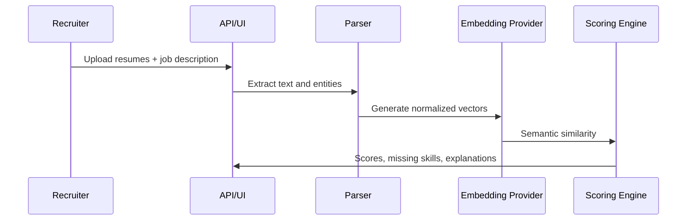

# ATS Resume Screening

AI-powered ATS resume screening monorepo with a Streamlit MVP and a SaaS-ready FastAPI + Next.js foundation.

## Branch Strategy

This repository is now intended to be used as a **single monorepo branch**, not as two long-lived branches with different products.

- `main`: canonical branch for the full monorepo. It contains the Streamlit MVP, shared Python packages, FastAPI backend, Next.js frontend, tests, docs, and infrastructure files.
- Feature branches: create short-lived branches from `main` for changes, for example `feature/scoring-tuning`, `fix/parser-docx`, or `docs/streamlit-deploy`, then merge them back into `main`.
- `dev`: no longer needed as a separate architecture branch. If it exists remotely from an earlier workflow, treat it as historical or delete it after confirming all useful work has been merged into `main`.

Keeping everything on `main` makes the MVP easy to deploy on Streamlit Community Cloud while still preserving the SaaS-ready backend and frontend code in the same repository.

## Repository Layout

```txt
app.py               Root Streamlit entrypoint for local/cloud deployment
apps/streamlit-app   Streamlit MVP UI
apps/api             FastAPI backend
apps/web             Next.js 15 frontend
packages/ai-engine   Embedding and LLM provider interfaces
packages/resume-parser PDF/DOCX/text parsing and extraction
packages/scoring-engine Modular scoring strategies
packages/shared-types Shared dataclasses
datasets             Sample resumes and job descriptions
docs                 Architecture, API examples, ADR notes
infra                Docker, nginx, scripts
tests                Python unit/API tests
```

## Quick Start

```bash
cp .env.example .env
python -m pip install -e .[api,dev]
streamlit run app.py
```

Or run the Dockerized stack:

```bash
docker compose up --build
```

Services:

- Streamlit MVP: <http://localhost:8501>
- FastAPI Swagger UI: <http://localhost:8000/docs>
- Next.js web app: <http://localhost:3000>
- Nginx gateway: <http://localhost:8080>

## Streamlit Community Cloud Deployment

Use Streamlit Community Cloud to test the end-to-end MVP workflow quickly. The hosted app only needs the root Streamlit entrypoint plus the Python packages used by the MVP; the FastAPI, Next.js, Docker, PostgreSQL, and Redis services stay in the repo for SaaS development but are not required for the Community Cloud app.

### What to upload

Upload/push the **whole monorepo** to GitHub on the `main` branch. Streamlit Community Cloud will read the files it needs from the repository:

```txt
app.py                         Required root entrypoint selected in Streamlit Cloud
requirements.txt               Required Python dependency list
apps/streamlit-app/app.py      Required Streamlit MVP implementation
packages/shared-types/         Required shared screening dataclasses
packages/resume-parser/        Required resume parsing package
packages/ai-engine/            Required embedding/scoring provider package
packages/scoring-engine/       Required scoring package
datasets/sample_resumes/       Optional sample resumes for demos
datasets/sample_jobs/          Optional sample job descriptions for demos
```

Do **not** upload only `apps/streamlit-app/app.py`; the app imports code from the `packages/` directories and uses the root `app.py` wrapper as the cloud-friendly entrypoint.

### Deploy steps

1. Push this repository to GitHub with the monorepo content on `main`.
2. Open <https://share.streamlit.io/> and choose **Create app**.
3. Select the GitHub repository and branch: `main`.
4. Set **Main file path** to:

   ```txt
   app.py
   ```

5. Leave advanced settings empty for the default deterministic TF-IDF workflow. Add secrets only if you later wire in hosted LLM or embedding providers.
6. Deploy the app.
7. In the app, upload one or more resumes, paste a job description, tune the scoring weights, and click **Run screening**.

### Easy workflow test

For a quick smoke test after deployment:

1. Open `datasets/sample_jobs/senior_ml_engineer.md` in GitHub and copy its contents into the app's **Job description** box.
2. Download the sample resume text files from `datasets/sample_resumes/` and upload them in the app.
3. Click **Run screening**.
4. Review **Screening Results**, **Candidate Deep Dive**, **Analytics**, and the CSV/JSON export buttons.

If deployment fails while installing dependencies, first check the Streamlit build logs. The largest dependencies are `sentence-transformers` and `spacy`; the default app path uses TF-IDF, so those can be made optional later if Community Cloud resource limits become an issue.

## MVP Workflow

1. Upload multiple PDF/DOCX/TXT resumes.
2. Paste or upload a job description.
3. Adjust semantic, keyword, skills, and experience weights.
4. Review ranked candidates, explanations, extracted fields, analytics, and CSV/JSON exports.

## SaaS Foundation

The backend includes normalized SQLAlchemy models for organizations, users, jobs, resumes, screenings, and screening results; JWT primitives; upload validation; CORS; metrics; and OpenAPI docs. The frontend includes dashboard, jobs, candidates, screening results, analytics, settings, signup, and login routes with Tailwind styling and client state foundations.

## AI Pipeline



Default local embedding mode is TF-IDF for fast reproducible tests. Set `EMBEDDING_PROVIDER=sentence-transformers` to use `sentence-transformers/all-MiniLM-L6-v2`.

## Testing

```bash
pytest -q
ruff check .
mypy packages apps/api
```
