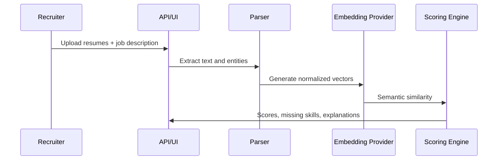

# ATS Resume Screening

AI-powered ATS resume screening monorepo with a Streamlit MVP and a SaaS-ready FastAPI + Next.js foundation.

## Branch Strategy

- `main`: quick Streamlit MVP for validation and Streamlit Community Cloud deployment.
- `dev`: SaaS-ready architecture with FastAPI, Next.js, PostgreSQL, Redis, background processing, and multi-tenant domain modeling.

This workspace contains both deliverables so the shared packages can be reused across branches.

## Repository Layout

```txt
apps/streamlit-app   Streamlit MVP
apps/api             FastAPI backend
apps/web             Next.js 15 frontend
packages/ai-engine   Embedding and LLM provider interfaces
packages/resume-parser PDF/DOCX/text parsing and extraction
packages/scoring-engine Modular scoring strategies
packages/shared-types Shared dataclasses
datasets             Sample resumes and job descriptions
docs                 Architecture, API examples, ADR notes
infra                Docker, nginx, scripts
tests                Python unit/API tests
```

## Quick Start

```bash
cp .env.example .env
python -m pip install -e .[api,dev]
streamlit run app.py
```

Or run the Dockerized stack:

```bash
docker compose up --build
```

Services:

- Streamlit MVP: <http://localhost:8501>
- FastAPI Swagger UI: <http://localhost:8000/docs>
- Next.js web app: <http://localhost:3000>
- Nginx gateway: <http://localhost:8080>

## MVP Workflow

1. Upload multiple PDF/DOCX/TXT resumes.
2. Paste or upload a job description.
3. Adjust semantic, keyword, skills, and experience weights.
4. Review ranked candidates, explanations, extracted fields, analytics, and CSV/JSON exports.

## SaaS Foundation

The backend includes normalized SQLAlchemy models for organizations, users, jobs, resumes, screenings, and screening results; JWT primitives; upload validation; CORS; metrics; and OpenAPI docs. The frontend includes dashboard, jobs, candidates, screening results, analytics, settings, signup, and login routes with Tailwind styling and client state foundations.

## AI Pipeline



Default local embedding mode is TF-IDF for fast reproducible tests. Set `EMBEDDING_PROVIDER=sentence-transformers` to use `sentence-transformers/all-MiniLM-L6-v2`.

## Testing

```bash
pytest -q
ruff check .
mypy packages apps/api
```
