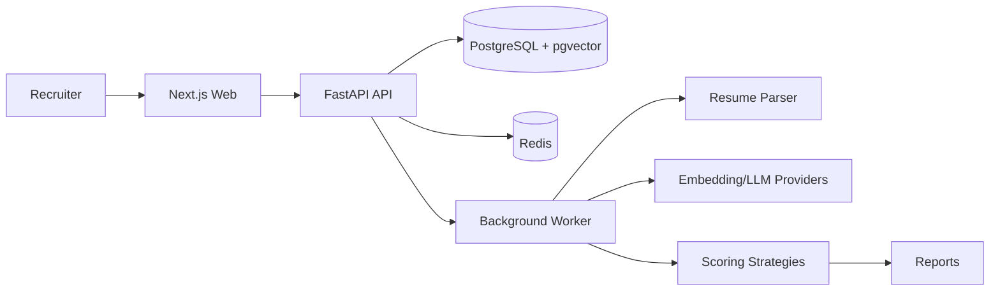

# Architecture

## Decisions

- Keep parser, AI provider interfaces, and scoring engine in reusable packages so Streamlit and FastAPI use the same core logic.
- Use deterministic TF-IDF embeddings by default for reliable local/CI execution; switch `EMBEDDING_PROVIDER=sentence-transformers` for production semantic embeddings.
- Model SaaS entities around organizations, users, jobs, resumes, screenings, and reports to support multi-tenancy from day one.
